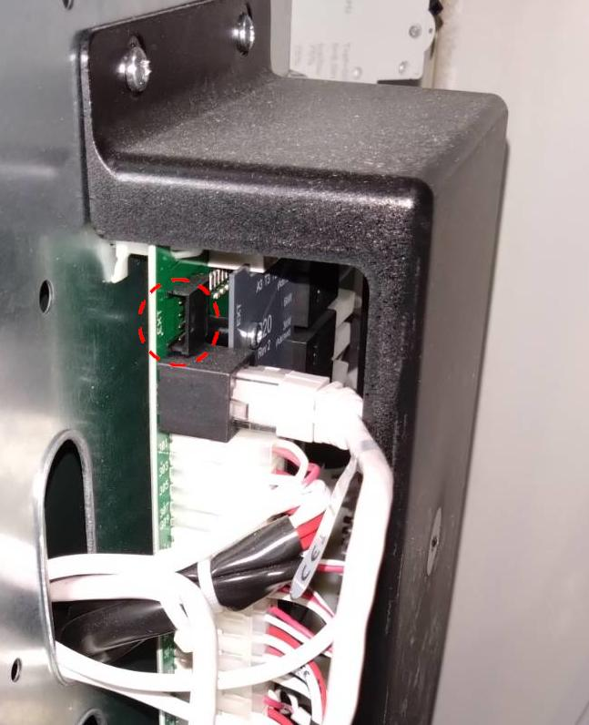

# Modbus for Thermia Diplomat geothermal heat pumps

This project implements a Modbus RTU slave interface to Thermia heat pumps. The firmware is written in plain C for an AVR microcontroller.

This software has been developed in conjunction with a Thermia Diplomat Optimum heatpump manufactured in the year 2020. It could work with other Thermia or Danfoss heat pumps of the same era, but there is no guarantee for that.

## Disclamer 

This software and schematics in this repository should be considered an experimental project, and is published just as a reference in case somebody finds it interesting. There is no guarantee that anything in this repository is suitable for any kind of use. You should never open the covers of the heat pump unless you know what you are doing and understand the risks. You must always ensure that the device is disconnected from the electrical supply.

## What exists currently

A firmware implementation that polls a number of Control unit registers, and makes the values accessible via Modbus. There is no support for changing value of registers via Modbus. There are several reliability issues howeer.

The firmware is being developed on an Arduino Uno board, ATmega328P microcontroller. There is a Modbus RTU interface implementation, but there is no RS485 transciever support yet. 

* Modbus RTU slave address 10
* 9600 bps, 8E1

Modbus poll command:

```sh
mbpoll -a 10 -b 9600 -P even -t 3 -r 1000 -c 20  /dev/ttyACM0
```


## Background information: The Ext.COM bus

Careful examination of the Thermia Diplomat wiring diagram shows that the Control unit (451) has an interface called "Ext. COM". This is the only official reference of what appears to be an I2C bus, as explained in the Finnish-language article ["Danfoss-lämpöpumpun salaisuudet"](https://omakotikotitalomme.blogspot.com/2015/03/danfoss-lampopumpun-salaisuudet.html). 


### Physical layer

The Ext.COM bus connector is labelled "EXT" on the Control unit board inside the heat pump enclosure. The connector is a 4-way pin header with 2.54 mm pitch.

)

Measurements on a 2020 Thermia Diplomat Optimum show the EXT bus as I2C with 5V signal levels and operating at 400 kHz serial clock rate. The pin assignment is the following, starting from the topmost pin:

1. +5V Vcc supply rail?
2. SCL
3. SDA
4. GND

I haven't been able to find any information about the +5V rail on the connector, so my advice is that you should not use it to power anything, instead you should power your Modbus interface board from an external power supply.


### I2C bus details

In the I2C bus, the heat pump is the bus master. A quick explanation of the bus follows: The master periodically polls certain I2C addresses on the bus by sending a poll byte, and the slaves respond with a request byte or a place-holder value. 

The bus master polls for expansion card at address 0x2e, but they say that also other expansion cards at other addresses are polled for. However, I have never witnessed any other i2c slave being addressed, besides 0x2e. It also appears that third-party commercial products (ThermIQ, which I have no experience with) also implement an i2c interface with same slave address 0x2e.

If the slave responds with a place-holder value, then nothing special happens, and the bus master sends an other poll soon after. But if the slave responds with a request byte, then the bus master sends the data corresponding to the request byte with in a subsequent bus write transaction.

In practice, the bus works like this: the master addresses slave 0x2e in a write transaction containing one byte 0xfe, which can be understood as the master asking the slave if there is something the slave wants to do. 

The slave has the possibility to reply with one byte. The byte can either have special value 0xff, which probably is just an acknowledgement of slave presence, and in that case the master does nothing more, it just sends an other probe after a short while. 

But if the slave responds with a byte other than 0xff, then that byte value is understood to be the address a of data register whose value the slave wants to know. In that case, the bus master starts an other I2C write transaction addressing the slave, and sends three bytes: the requested register address, and the low and high bytes of the 16-bit register value. 

### I2C implementation notes

The current implementation does the protocol processing inside callbacks called from the i2c (twi) interrupt routine - this is OK for now, but we must be extra careful that we don't start spending too much time inside the isr, as that causes the MCU to hold SCL low during that time (in other words, we would introduce clock stretching) and we don't know if the Thermia EXT bus master supports that.

## References

EXT bus secrets revealed: https://omakotikotitalomme.blogspot.com/2015/03/danfoss-lampopumpun-salaisuudet.html
Registers: https://thermiq.net/ThermIQ_MQTT_Installation.pdf